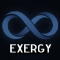

# A Different Perspective

**Jeroen van Bemmel**  
Exergy ∞ LLC  
**February 2026**

**The Recursive Bridge: Beyond the Flat Earth Logic of Modern Physics**

## I. The Fundamental Disconnect

Modern physics is currently deadlocked by a "Flat Earth" crisis. We attempt to map a recursive, hyperbolic reality onto a symmetrical, linear plane. This has resulted in the "invention" of Dark Energy, Dark Matter, and the "Spookiness" of quantum mechanics—placeholders for a geometric mismatch that a linear model cannot reconcile.

This framework proposes that the universe is a **bridge** between two states:

1. **The Smooth Potential:** The symmetrical, global state represented by the early universe (CMB).
2. **The Bumpy Reality:** The local, materialized state where energy has "restructured" into persistent, unique loops.

---

## II. Mass as Recursive Looping Energy

Mass is not an intrinsic property but an **emergent state of existence.** As Gabriel Tarde noted, "To exist is to differ."

* **The Stability of Φ:** Energy materializes by looping. To avoid self-annihilation via resonance, these loops must follow the **Golden Ratio (Φ)**, the most irrational number. This ensures the signal never perfectly overlaps, allowing a "difference" to persist against the vacuum.
* **The Death of the Master Formula:** Because  is irrational and the process is recursive (loops within loops), there is no static formula for mass or gravity—only **approximations**.

---

## III. The Hubble Tension: A Geometric Residual

We have misidentified **Redshift** as a loss of energy due to expansion. In a recursive hyperbolic bridge, **energy is preserved but restructured.**

* **The Discrepancy:** The ~9% gap between the CMB ($H_0 \approx 67$) and the Local Ladder ($H_0 \approx 73$) is the **topological parallax** of the bridge.
* **The Mechanism:** The CMB measures the "Smooth" potential before significant recursion. The Local Ladder measures the "Bumpy" reality where energy has navigated the hyperbolic depth of local matter.
* **Acceleration as Illusion:** We perceive "Dark Energy" because the recursive, hyperbolic nature of the "road" makes the realized path length grow exponentially compared to flat-map predictions.

---

## IV. The Shadow Principle: Entanglement and Gravity

Drawing from the **Aharonov-Bohm Effect**, this framework views "spookiness" as a failure of perspective.

* **Quantum Spookiness:** Entangled particles are not "communicating." They are two projections (**shadows**) of a single, higher-dimensional energy structure.
* **The Singular Path:** While multiple paths are mathematically possible, the energy realizes only **one** path—the one that successfully synchronizes with the local hyperbolic potential.
* **Gravitational Lensing:** This is the refraction of light through the "higher-density" hyperbolic geometry of Φ-stabilized loops. "Dark Matter" is the name we give to the extra path length we fail to see on our flat maps.

---

## V. Entropy and the Black Hole Limit

Entropy is not a slide into disorder (Heat Death), but the **accumulation of complexity (difference).**

* **The Information Paradox:** Information is never lost in a Black Hole; it is **maximally restructured.** * **The Limit of Recursion:** A Black Hole is a region where Φ-loops are so densely packed that the "Smooth Potential" can no longer penetrate. It is the ultimate library of "differences."
* **The Event Horizon:** A phase boundary where the restructuring rate required to stay in sync exceeds the speed of light.

---

## VI. Conclusion: Physics as Navigation

By abandoning the search for a symmetrical "Theory of Everything," we recognize that the universe is an open, recursive process. The lack of a master formula is not a failure of mathematics; it is the **signature of reality.** The "Tension" in our measurements is the proof that we live in a universe of **Depth**, where the interaction between the smooth potential and the bumpy realization creates the friction we call existence. We are not watching a machine wind down; we are watching a topology come to life.
