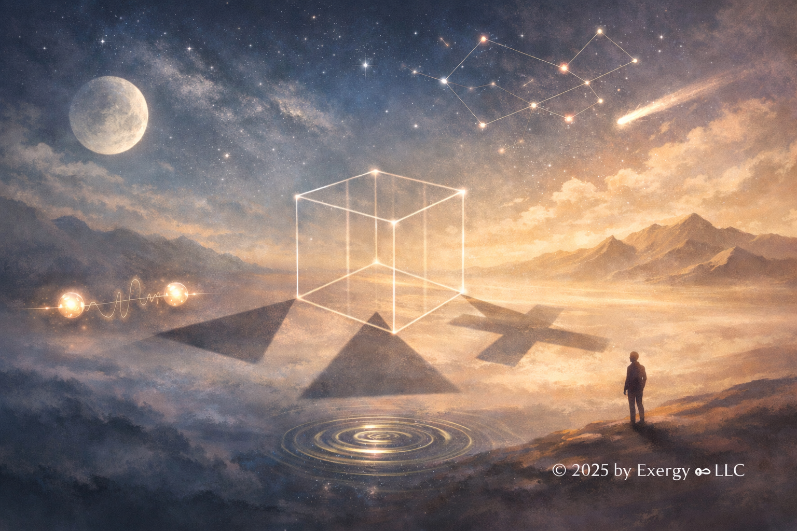
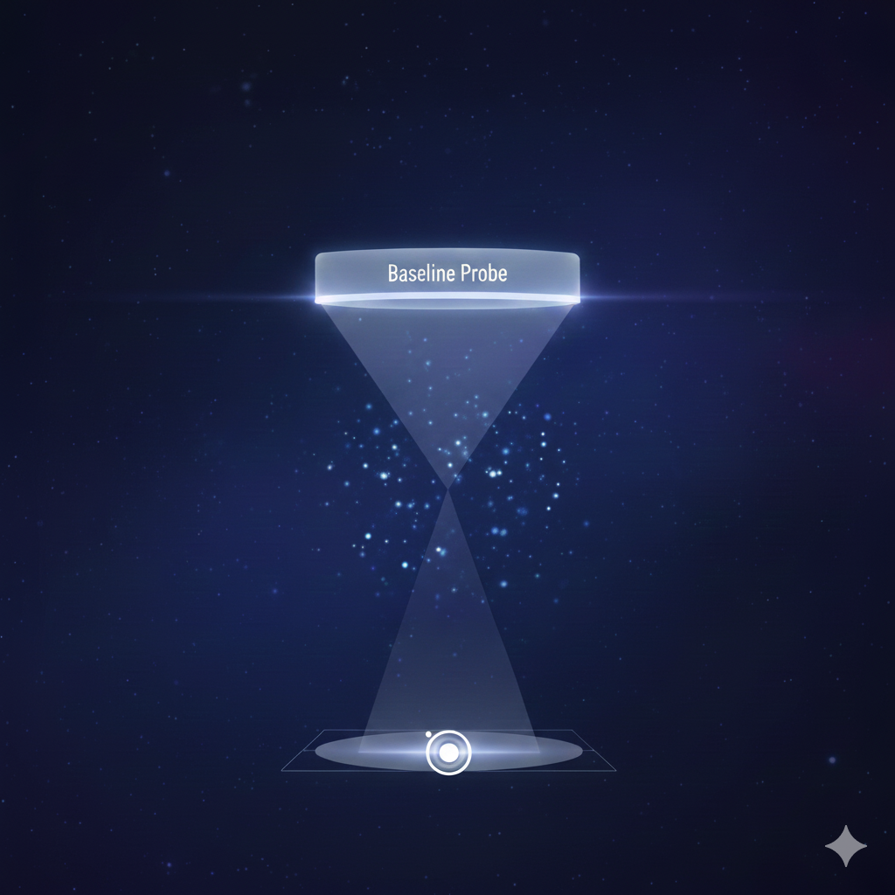

# Quantum Spookiness Is a Human Misunderstanding

**Jeroen van Bemmel**  
Exergy ∞ LLC  
**December 2025**

**The theory describes entangled particles as projections of a single quantum state—like shadows cast by one cube. This way of thinking dissolves the spookiness: there's no faster-than-light communication because there's nothing to communicate about. The correlation was built into the structure from the start.**

Quantum mechanics has a reputation problem. Particles seem to communicate instantly across vast distances. Einstein called it "spooky action at a distance." But what if the particles were never separate to begin with?

---

## The Puzzle

A machine creates two entangled photons. One flies to Alice in New York, the other to Bob in Tokyo. They measure polarization. When Alice gets "vertical," Bob always gets "horizontal." Perfect anti-correlation, every time.

But before measurement, each result appears completely random. The particles are thousands of miles apart. Measurements happen simultaneously—no signal could travel between them at light speed. Yet the results are perfectly coordinated.

Einstein thought this proved quantum mechanics was incomplete. There must be hidden information—secret instructions each particle carries from birth. In the 1960s, physicist John Bell proved mathematically that no such hidden instructions could work. Experiments since then have confirmed this beyond doubt.

Perfect coordination without predetermined results and without communication. Every attempted explanation tries to preserve the intuitive picture of particles as separate, independent objects. What if that assumption is wrong?

---

## The Shadow Principle

Imagine a three-dimensional cube floating in space. Shine lights from different angles to create shadows on different walls. Shadow A looks like a square. Shadow B looks like a rectangle. Shadow C looks like a hexagon.

Different appearances. Different locations. But are they separate objects?

No. They're all projections of the same cube onto different surfaces.

Now imagine the cube is invisible. You can only see the shadows. You might think you're looking at three separate objects. But when the cube rotates, all the shadows change in coordinated ways. This coordination doesn't happen because the shadows communicate. It happens because they're projections of the same underlying structure.

**Alice's particle and Bob's particle are like those shadows—different projections of a single quantum object.** The single quantum object exists in a higher-dimensional mathematical space. When Alice measures, she's looking at one projection. When Bob measures, he's looking at another projection. The measurements are coordinated not because anything travels between them, but because they're both revealing aspects of the same underlying thing.

The mathematical description supports this directly. When two particles are entangled, they're described by a single quantum state—a mathematical object that can't be separated into independent parts. This isn't mathematical convenience. It's a fundamental feature of how quantum mechanics describes reality. The mathematics tells us these particles aren't independently describable. They form an inseparable whole.

Nothing new is being added to the theory—only the assumption that entangled particles are independent objects is being removed.

This way of thinking dissolves the mystery. There's no faster-than-light signaling because there's nothing to signal. The correlation is a property of the unified state, not something traveling between particles.

---

## Why Measurement Looks Random

If the quantum state is unified, why do we only see "parts" of it? Why does it appear to "snap" into a single, random result when we measure?

**To see anything, we must first establish a baseline.** A white letter on white background is invisible. To read the letter, there must be contrast. In quantum mechanics, the full quantum state is like that white background. It contains all possibilities simultaneously, which to an observer looks like nothing, or pure potential.

To extract information, we must introduce a measurement axis. This act creates the baseline. By choosing to measure spin along the Z-axis, we create the contrast necessary for a result to appear. The result—up or down—is the contrast that emerges against the baseline we provided.

We cannot see the full quantum state for the same reason a two-dimensional being cannot see a three-dimensional sphere. Our measurements require baselines to function. We don't see the cube—the unified state. We only see the shadows—the particles—because only shadows provide the contrast our classical world requires.

The randomness Alice and Bob experience isn't disorder. It's the result of fitting a non-coordinate-based reality into a coordinate-based frame. When you force a circle to be measured against a square baseline, you'll always find slack or error in the fit. In quantum mechanics, that slack is called probability.

---

## Why This Dissolves the Spookiness

If particles are projections of a single quantum object, there's no mystery about coordination. They don't need to communicate because there's nothing to communicate about. The correlation was built into the structure from the beginning.

Einstein worried: if changing something in New York instantly affects something in Tokyo, couldn't you use this to send messages faster than light? No. Alice can't control what result she gets. She's observing a projection—she can't control the underlying object. Bob sees random results too. Only when Alice and Bob later compare notes using normal communication do they discover the correlation.

Distance doesn't matter. Whether particles are one meter or one light-year apart, they're still projections of the same quantum state. The correlation is a property of that shared state, not something traveling through space. This is why quantum entanglement has been demonstrated across hundreds of kilometers with zero degradation.

Bell's theorem rules out theories where each particle carries independent information. Most interpretations violate this by allowing influence between particles, which creates the faster-than-light problem. This way of thinking violates the assumption instead: if we interpret the theory as describing particles that don't carry independent information because they aren't independent particles to begin with, then there's one quantum state. Measurements reveal different aspects of it.

Einstein's intuition about locality—that things should only be influenced by their immediate surroundings—was correct. This perspective respects relativistic locality in the sense that no causal influence propagates faster than light: particles don't influence each other at a distance. According to this interpretation, they're just not separate objects to begin with.

---

## Reality as Relationship

The shadow analogy points to something profound: **What if reality is fundamentally relational rather than made of independent objects?**

In everyday life, we think of objects as having independent existence. A rock is a rock, whether or not anything else exists. But quantum mechanics hints at something different. What if things exist in relationship to other things? What if the properties we measure aren't properties objects "have" independently, but properties that emerge in the context of measurement, in relation to other systems?

According to the theory, entangled particles don't have independent states. They exist as a relationship—a pattern of correlations. **In this interpretation, the relationship is more fundamental than the individual relata.**

This might not be just a quirk of quantum mechanics. The theory might be telling us something deep about reality itself. What if what we call "objects" are really patterns or relationships that appear stable and independent under certain conditions but reveal their relational nature when probed more deeply?

The spookiness disappears when we interpret the theory this way: we're not seeing separate objects coordinating mysteriously. We're seeing different aspects of a unified structure. In this view, the structure itself is what's real. The apparent separation is how we observe it.

This reframing has implications beyond quantum mechanics. If we take the theory to suggest reality is fundamentally relational, our everyday experience of separate, independent objects becomes an approximation—useful for navigating the world, but not the deepest truth about how things are.

---

## Connections

This relational view connects to modern physics in unexpected ways. In quantum field theory, particles aren't fundamental—fields are. Particles are excitations in fields. This fits perfectly: what we call "separate particles" might be different disturbances in a unified field structure.

Some theories suggest information about a volume of space might be encoded on its boundary surface—like a hologram. The three-dimensional reality we experience might be a projection of information stored on a two-dimensional surface.

Attempts to unify quantum mechanics and general relativity suggest space and time themselves might be emergent from more fundamental quantum relationships. If space is emergent, it's natural that "spatial separation" wouldn't always mean "ontological independence." Space itself might be a relationship, not a container.

The pattern repeats across modern physics: what appears separate and diverse at one level reveals itself as unified and relational at a deeper level. Quantum entanglement might be our first clear window into this deeper structure.

---

## What This Changes

This framework explains why entanglement correlations are perfect and instant—they're properties of shared structure, not caused by anything traveling. It explains why distance doesn't matter—correlation is a global property, not a local process. It explains why you can't send messages faster than light—you can only observe projections, not control underlying structure. It explains why Bell's theorem rules out hidden variables—hidden variables assume independent particles with separate properties, which is wrong for entangled systems. It explains why outcomes are correlated and probabilistic, but not why any particular measurement yields one definite result. It doesn't explain why probabilities follow the specific mathematical rule they do. These questions remain open.

For quantum technology, understanding what entanglement really is helps design better systems. For education, this framework makes entanglement intuitive rather than mysterious. For further physics, if we interpret quantum mechanics as suggesting reality is fundamentally relational, this might guide attempts to unify quantum mechanics with gravity. For philosophy, quantum mechanics provides concrete test cases for ancient puzzles about objects, properties, and relationships.

---

## The Invisible Structure

The theory suggests that everyday intuitions—solid, separate objects with definite properties existing in space—are approximations. Useful approximations for everyday life, but approximations nonetheless.

According to this interpretation, reality is more subtle. More connected. More like a unified dance than separate dancers.

The theory describes a universe where particles separated by billions of miles can be aspects of a single quantum state. Where the whole can be more real than the parts. Where relationships precede the things being related.

Perhaps everything we see as separate are different projections of a more fundamental unity. Perhaps the apparent diversity of the world is like different shadows of a single, invisible cube.

We can't see the cube directly—we only perceive shadows. Yet shadows reveal hints of its structure, and through them, we catch glimpses of a reality more interconnected, more relational, more subtle than everyday experience suggests.

The spookiness of entanglement dissolves. We're not witnessing distant objects coordinating mysteriously. We're witnessing different aspects of unified structure—one whose full shape is beyond the limits of our measurements, our frames, even our imagination.

Quantum mechanics suggests that what we call "separate" may be an approximation, useful for navigating the world but never the whole story. Every measurement, every perspective, every baseline we fix gives us only a slice of deeper, unfinished reality.

What might the universe look like if we could perceive the whole? Perhaps that question will always remain unanswered. But in contemplating it, we open ourselves to a vision of reality that is alive, relational, endlessly surprising—a reality whose full dance we may glimpse but never fully capture.

That's not spooky. That's beautiful.

---

**For Further Reading**

If this has sparked curiosity, accessible resources include *Quantum Entanglement* by Jed Brody for gentle introduction, *The Fabric of Reality* by David Deutsch for broader context, and *Something Deeply Hidden* by Sean Carroll for deeper exploration. For those comfortable with mathematics, *Quantum Mechanics: The Theoretical Minimum* by Leonard Susskind provides rigorous foundation. PBS Space Time and Minute Physics offer excellent video introductions.

The universe is comprehensible. Not always easy to comprehend, but comprehensible. That's a profound gift, and one we should use.

Thank you for reading.

---

### License
To the extent possible under law, Jeroen van Bemmel has waived all copyright and related or neighboring rights to this work via [CC0 1.0 Universal](https://creativecommons.org/publicdomain/zero/1.0/).
